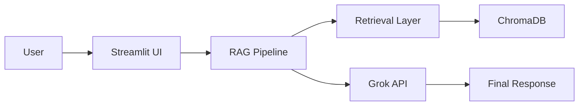
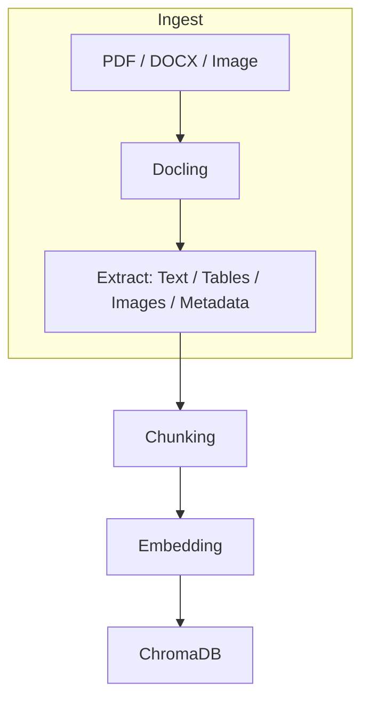
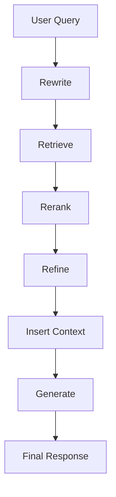
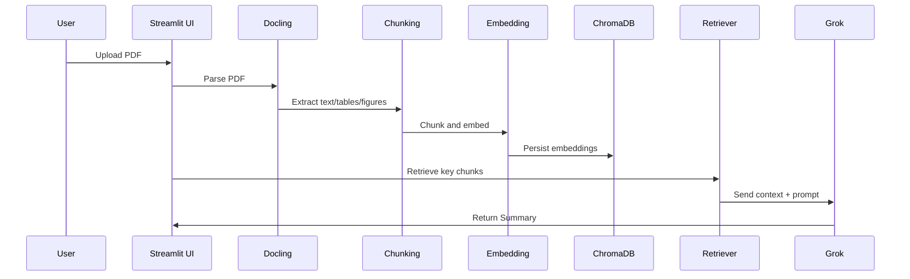

# Multimodal RAG using Docling, ChromaDB, and Grok API

[](#)
[](#)
[](#)
[](#)
[](#)


## Project Overview

Multimodal RAG (Retrieval-Augmented Generation) using Docling, ChromaDB, and Grok API is an open-source system designed to ingest and reason over diverse document modalities (PDFs, DOCX, images, tables, charts and plain text). It combines document understanding (Docling), local embedding models for semantic search, a persistent vector store (ChromaDB) and an LLM-based generator (Grok API) to produce grounded, context-aware answers and summaries.

Problems solved

- Allow users to query and summarize documents across modalities.
- Provide grounded answers supported by retrieved document fragments (chunks).
- Persist embeddings and metadata for repeatable retrieval and low-latency search.

Why multimodal RAG matters

Multimodal RAG unlocks knowledge in formats beyond plain text (images, tables, charts), enabling teams to extract insights from real-world documents, accelerate research, automate report summarization, and build reliable document assistants.

Key capabilities

- Multimodal ingestion (PDF/DOCX/images/tables/charts)
- Persistent semantic search with ChromaDB
- Re-ranking and refinement for improved retrieval quality
- Prompt-ready context construction with token budgeting and deduplication
- Generation via the Grok API with retry and timeout handling
- Streamlit-based UI for quick demos and human-in-the-loop exploration

Main technologies used

- Python 3.10+
- Docling (document parsing)
- ChromaDB (vector persistence)
- Sentence Transformers (embeddings)
- Grok API (generation)
- Streamlit (frontend)


---

## Features

- Multimodal document ingestion (PDF, DOCX, images, tables, charts)
- PDF summarization workflow
- Question answering over documents (RAG)
- Retrieval pipeline visualization in UI
- ChromaDB persistent storage for embeddings and metadata
- Reranking (cross-encoder / heuristic fallback)
- Pluggable, modular architecture (interfaces + registries)
- SOLID-based design: Strategy pattern, Factory pattern, Dependency Injection
- Open-source friendly: tests, registry-based extensions, clean package boundaries


---

## Technology Stack

| Layer | Technology |
|---|---|
| Backend | Python 3.10+, Docling, ChromaDB, Sentence Transformers, requests, pytest |
| Generator | Grok API (pluggable for OpenAI / Claude / Gemini / Ollama in future) |
| Frontend | Streamlit |
| Design Patterns | SOLID Principles, Strategy Pattern, Factory Pattern, Dependency Injection |


---

## High-Level Architecture


 

---

## Multimodal Processing Flow



---

## Detailed RAG Pipeline



### Stage responsibilities

- Rewrite: normalize or expand the user query to improve retrieval recall.
- Retrieve: use embedding-based nearest neighbor search to fetch candidate chunks from ChromaDB.
- Rerank: score retrieved chunks for finer relevance ordering (cross-encoder or heuristic fallback).
- Refine: filter or transform candidates (e.g., deduplicate, prefer recent docs).
- Insert Context: build a prompt-ready context with token budgeting, deduplication, ordering, and metadata preservation.
- Generate: call the LLM (Grok API) with the inserted context and query to produce a grounded answer.


---

## Folder Structure

```
multimodal-rag/
├── README.md
├── requirements.txt
├── .gitignore
├── .env
├── app/
│   ├── __init__.py
│   ├── main.py
│   ├── ui/
│   │   └── streamlit_app.py
│   ├── ingestion/
│   │   ├── docling_loader.py
│   │   └── strategies/
│   │       ├── pdf_strategy.py
│   │       ├── docx_strategy.py
│   │       ├── image_strategy.py
│   │       └── ...
│   ├── chunking/
│   │   ├── chunker_interface.py
│   │   ├── text_chunker.py
│   │   └── table_chunker.py
│   ├── embeddings/
│   │   ├── embedding_interface.py
│   │   └── sentence_transformer_embedding.py
│   ├── generation/
│   │   ├── generator_interface.py
│   │   ├── generator.py
│   │   └── summarizer.py
│   ├── pipelines/
│   │   ├── rag_pipeline.py
│   │   └── pdf_summary_pipeline.py
│   ├── retrieval/
│   │   ├── rewriter_interface.py
│   │   ├── retriever_interface.py
│   │   ├── reranker_interface.py
│   │   ├── context_builder.py
│   │   └── retriever_vector.py
│   ├── vectordb/
│   │   ├── vectordb_interface.py
│   │   └── providers/
│   │       └── chroma_store.py
│   └── models/
│       ├── document.py
│       └── chunk.py
└── tests/
		├── test_context_builder.py
		├── test_grok_generator.py
		└── test_rag_pipeline.py
```

### Folder responsibilities

- `app/ingestion`: Document loaders and parsing strategies (Docling integration).
- `app/chunking`: Splitting extracted content into retrievable chunks.
- `app/embeddings`: Embedder interface and implementations.
- `app/vectordb`: Vector store interfaces and provider implementations (ChromaDB supported).
- `app/retrieval`: Query rewriting, retrieval, reranking, context construction and pipeline orchestration.
- `app/generation`: Generator interface and LLM implementations (Grok API adapter).
- `app/ui`: Streamlit demo UI.
- `app/pipelines`: High-level pipelines (RAG, PDF summarization).
- `tests`: Unit tests and integration smoke tests.


---

## Object-Oriented Design

### Key interfaces

- `VectorStore` (app/vectordb/vectordb_interface.py): abstract methods for `add_documents`, `query`, `persist`, `delete`.
- `Embedder` (app/embeddings/embedding_interface.py): `embed_documents`, `embed_query`.
- `Retriever` (app/retrieval/retriever_interface.py): `retrieve(query, top_k)`.
- `Generator` (app/generation/generator_interface.py): `generate(query, inserted_context, timeout, retries)`.

How Open/Closed Principle is achieved

- Registry and factory patterns allow adding new embedders or vector stores without changing core modules. New implementations register themselves using decorators (e.g., `@register_vectordb`).

How Dependency Inversion is achieved

- High-level modules depend on abstract interfaces (e.g., `VectorStore`, `Embedder`, `Generator`) instead of concrete implementations. Concrete implementations are injected at runtime using factories or constructor injection (Dependency Injection).


---

## ChromaDB Persistence Layer

This project uses ChromaDB as the primary vector store. Key responsibilities:

- Collection creation: create or get named collections for different datasets.
- Upsert: add documents (ids, texts, metadata, embeddings) in batch; Chroma handles upserts.
- Similarity search: query by embedding to retrieve documents ordered by similarity.
- Metadata filtering: pass `where` filters to restrict search by metadata (source, date, tags).
- Persistence: Chroma writes to disk (duckdb+parquet) enabling persistent local storage across runs.

Implementation notes:

- Documents stored as `Document` objects with `id`, `content`, `metadata`, and `embedding`.
- `ChromaVectorStore` wraps chromadb client with `add_documents`, `query`, `persist`, and `delete`.


---

## PDF Summarization Workflow




---

## Installation Guide

1. Clone the repo

```bash
git clone https://github.com/your-org/multimodal-rag.git
cd multimodal-rag
```

2. Create and activate a virtual environment

```bash
python -m venv venv
# Windows
venv\\Scripts\\activate
# macOS / Linux
source venv/bin/activate
```

3. Install dependencies

```bash
pip install -r requirements.txt
```

4. Create a `.env` file in the project root and add your secrets (see Environment Variables below).

5. Run the Streamlit demo UI

```bash
streamlit run app/ui/streamlit_app.py
```


---

## Environment Variables

| Variable | Description | Required |
|---|---|---|
| `GROK_API_KEY` | API key for Grok API (used by `GrokGenerator`) | Yes |
| `CHROMA_PERSIST_DIR` | Optional path for local Chroma persistence (defaults to `./chroma_db`) | No |


---

## Future Enhancements

- Hybrid search (dense + sparse retrieval) for improved recall.
- Graph RAG for structured reasoning over entities and relations.
- Multi-agent workflows to coordinate specialized models for extraction and reasoning.
- Additional vector databases (FAISS / Pinecone / Weaviate) as optional providers.
- Additional LLM providers (OpenAI, Claude, Gemini, Ollama) with the same `Generator` interface.
- Improve OCR and multimodal reasoning for figures and scanned documents.


---

## Contribution Guide

We welcome contributions! Please follow these steps:

1. Fork the repository
2. Create a feature branch: `git checkout -b feat/your-feature`
3. Commit changes with clear messages
4. Push and open a Pull Request

Include tests for new features and follow existing code style. We use registry-based patterns for adding new providers; consult `app/*_interface.py` modules for examples.


---

## License

This project is released under the MIT License. See `LICENSE` for details.

```
MIT License

Copyright (c) YEAR Your Name

Permission is hereby granted, free of charge, to any person obtaining a copy
of this software and associated documentation files (the "Software"), to deal
in the Software without restriction, including without limitation the rights
to use, copy, modify, merge, publish, distribute, sublicense, and/or sell
copies of the Software, and to permit persons to whom the Software is
furnished to do so, subject to the following conditions:

[...]
```

---

## Badges

Add these to the top of the README for visibility (replace placeholders as needed):

- ``
- ``
- ``
- ``
- ``


---

## A note on reproducibility

- Tests are located under `tests/` and can be run with `pytest`.
- Use the `requirements.txt` to pin dependency versions for reproducible environments.


---

If you'd like, I can:

- Add an `LICENSE` file with MIT text.
- Add example `.env.example` and a minimal `requirements.txt` (or a pinned `requirements.lock`).
- Add a lightweight `dummy` generator registered for offline demos.


Happy to continue — tell me which of the extras you'd like next.
